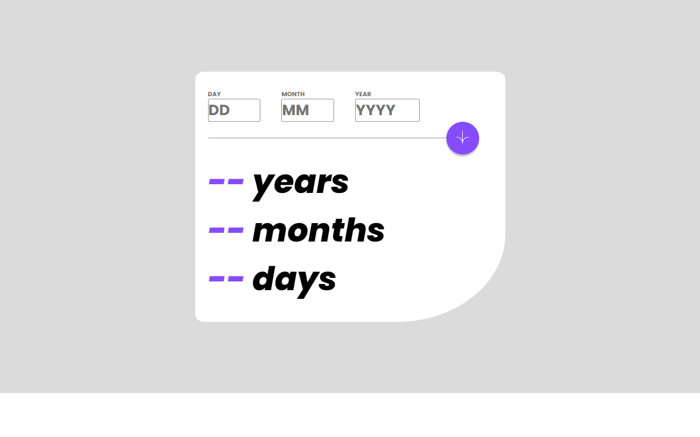
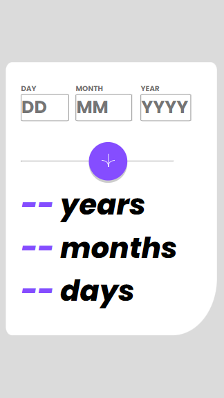

# Frontend Mentor - Age calculator app solution

This is a solution to the [Age calculator app challenge on Frontend Mentor](https://www.frontendmentor.io/challenges/age-calculator-app-dF9DFFpj-Q).

## Table of contents

- [Overview](#overview)
  - [The challenge](#the-challenge)
  - [Screenshot](#screenshot)
  - [Links](#links)
- [My process](#my-process)
  - [Built with](#built-with)
  - [What I learned](#what-i-learned)
  - [Continued development](#continued-development)
  - [Useful resources](#useful-resources)
- [Author](#author)
- [Acknowledgments](#acknowledgments)

## Overview

### The challenge

Users should be able to:

- View an age in years, months, and days after submitting a valid date through the form
- Receive validation errors if:
  - Any field is empty when the form is submitted
  - The day number is not between 1-31
  - The month number is not between 1-12
  - The year is in the future
  - The date is invalid e.g. 31/04/1991 (there are 30 days in April), even taking into account leap years (The date is invalid in 29/02/1994 but valid in 29/02/1996 and every other leap year).
- View the optimal layout for the interface depending on their device's screen size
- See hover and focus states for all interactive elements on the page

### Screenshot




### Links

- Solution URL: [Add solution URL here](https://github.com/light-roast/calculateageapp)
- Live Site URL: [Add live site URL here](https://calculate-your-real-age.netlify.app/)

## My process

### Built with

- Semantic HTML5 markup
- CSS custom properties
- Flexbox
- CSS Grid
- Responsive design pattern
- [React](https://reactjs.org/) - JS library
- [Next.js](https://nextjs.org/) - React framework
- [Styled Components](https://styled-components.com/) - For styles.
- New Date() object.

### What I learned

I learned a lot while completing this project. Handling numerous form interactions, especially checking for leap years, allowed me to create an interesting function. Using just React.js and CSS to style error validations instead of relying on default HTML validations was a major challenge, but I learned a lot by successfully doing so.

Calculating the real age was surprisingly difficult for me at first. I had to watch multiple YouTube videos on how to calculate age in years, months, and days to come up with a JS solution using React. State management with `useState()` and `useEffect()` were key components of this solution.

This is the leap year check:

```js
 useEffect(() => {
        
        if ((0 === year % 4) && (0 !== year % 100) || (0 === year % 400)) {
            setDaysInMonth(prevDaysInMonth => {
                const updatedDaysInMonth = [...prevDaysInMonth]; 
                updatedDaysInMonth[1] = 29;
                return updatedDaysInMonth;
              });
        } else {
            setDaysInMonth(prevDaysInMonth => {
                const updatedDaysInMonth = [...prevDaysInMonth]; 
                updatedDaysInMonth[1] = 28;
                return updatedDaysInMonth;
        });
          };

        
    }, [year]);
```


And this is the real age calculation function:
```js
function calculateRealAge(year, month, day, monthArr) {
    const actualDate = new Date();
    let d = actualDate.getDate();
    let m = actualDate.getMonth()+1;
    console.log(m);
    let y = actualDate.getFullYear();
      
    if (d < day) {
      m--;
      let actualDays = d + (monthArr[m+1]);
      let realDays = actualDays - day;
      setDays(realDays);
    } else {
      let realDays = d - day;
      setDays(realDays);
    }

    if (m < month) {
      y--;
      m += 12;
      let realMonths = m - month;
      setMonths(realMonths);
    } else {
      let realMonths = (m - month);
      setMonths(realMonths);
    }
  
    setYears(y-year);
  };
```


### Continued development

I would like to see a solution for this project that uses only flexbox, since I still struggle a bit with its usage. Additionally, I want to learn the basics of testing for this kind of React app, specifically guided by the question: what should I test in this specific app?


### Useful resources

- [YouTube video tutorial to calculate real age](https://www.youtube.com/watch?v=zKhOOkUEw5U) - This video helped me to understand te basic math calculations to return the real age in days, months and years.

## Author

- Website - [Daniel Echeverri LLano](https://light-roast.github.io/portafolio/)
- Frontend Mentor - [@light-roast](https://www.frontendmentor.io/profile/light-roast)
- Twitter - [@echeverri_llano](https://www.twitter.com/echeverri_llano)


## Acknowledgments

- [Juan Sebastián Silva](https://github.com/juansesilva) helped me with his expert feedback on the app's behavior and responsive design. He also helped me understand how to correctly import the icon image into the Vite React project so that it builds successfully.

